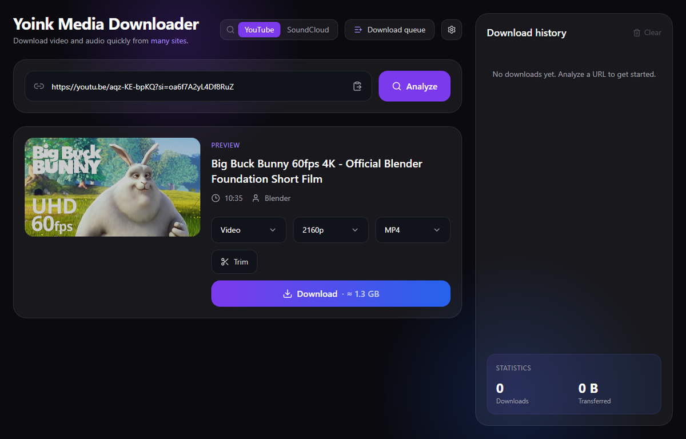

# Yoink Media Downloader

[](https://github.com/ayozetr/yoink-app/releases/latest)


[](LICENSE)
[](https://www.react.doctor/share?p=yoink&s=92&w=26&f=10)



**Yoink** is a **local** desktop app for downloading high-fidelity video and audio
from ~1800 sites — a clean, dark UI over
[yt-dlp](https://github.com/yt-dlp/yt-dlp) and [ffmpeg](https://ffmpeg.org/). Paste a
link (or a whole Spotify / YouTube playlist), pick your format, and it's yours: real
previews, live progress, and automatic music tagging. **Nothing leaves your machine
but the download itself** — no account, no telemetry, no cloud.

## Features

**⬇️ Download**
- **Paste any URL** or **search from the field** — preview with the real formats,
  from ~1800 sites; a header toggle searches **YouTube** or **SoundCloud**.
- **Any format** — MP4 / MOV / MKV video (optional subtitles + chapters) or
  MP3 / M4A / FLAC / WAV audio, up to **4K**.
- **Trim** a clip, save **presets**, and follow **live progress** (speed / ETA,
  with cancel + retry).
- **VR / 180°–360°** auto-detected and tagged so Quest / DeoVR / Heresphere play
  it in 3D.

**🎵 Music**
- **Import from Spotify, Deezer, Apple Music, Tidal or Amazon** (no account) —
  Yoink finds the best YouTube match and tags it with the *exact* source
  metadata and cover art.
- **Auto-tag** audio downloads (artist / album / cover) from Apple Music, Deezer
  or MusicBrainz, with a review step.
- **Lyrics** (LRCLIB) and **loudness normalization** to −14 LUFS — both optional.

**📋 Batches & library**
- **Playlists & a paste-many queue** — pick items, download in order, **resume**
  after a crash, drag to reorder or skip live; *playlist sync* pre-selects only
  what's new.
- **History & stats** kept locally (SQLite), with re-tagging, cover art and
  one-click open.

**🖥️ The app**
- **Self-contained desktop app** (Tauri · Linux + Windows) — bundles the backend
  **and ffmpeg**, so there's nothing else to install.
- **14 languages**, dark UI, desktop notifications, keyboard shortcuts,
  **auto-updates**, SponsorBlock, and cookies / proxy support.

## Install

**Just want the app?** Download the installer for your OS from the
**[latest release](https://github.com/ayozetr/yoink-app/releases/latest)** — Linux
(AppImage · deb · rpm) or Windows (msi · NSIS). It's self-contained (no Python or
ffmpeg to install) and updates itself.

## Run from source

```bash
python scripts/setup.py    # one-time: venv + backend deps + npm install
python scripts/dev.py      # run backend (:8756) + frontend (:5173) together
```

Then open <http://localhost:5173>. For development you need **ffmpeg** on your
PATH; the packaged desktop app bundles it. See [`CLAUDE.md`](CLAUDE.md) for
per-layer commands.

### Desktop build (Tauri)

```bash
python scripts/fetch_ffmpeg.py    # once: download ffmpeg+ffprobe (LGPL) to bundle
python scripts/build_backend.py   # bundle backend + ffmpeg as a PyInstaller onedir folder
npm run tauri build               # installers in src-tauri/target/release/bundle
```

Prerequisites: Rust toolchain and, on Linux, `webkit2gtk` (4.1); on Windows,
WebView2 + MSVC build tools. Full flow in [`docs/releasing.md`](docs/releasing.md).

## Project structure

Two layers that talk asynchronously — a **React + TypeScript + Tailwind** frontend and
a local **Python + FastAPI + yt-dlp** backend (metadata over REST `POST /api/info`,
downloads streamed live over a WebSocket `/api/ws/download`):

```
src/                      # frontend (React + TS + Tailwind)
├── components/{layout,ui}
├── features/
│   ├── autotag/          # Apple Music tagging cards (single + playlist batch)
│   ├── music/            # music-service import card (Spotify/Deezer/Apple/Tidal/Amazon)
│   ├── downloader/       # URL input (+ search-source toggle), preview, playlist, progress
│   ├── queue/            # download queue (format picker, music/playlist groups, skip/reorder)
│   ├── history/          # download history + stats (sidebar)
│   └── settings/         # settings modal (download dir, defaults, cookies, version, auto-update)
├── lib/                  # API client + download WebSocket
└── types/                # shared domain types (mirror the backend JSON contract)

backend/                  # FastAPI + yt-dlp engine (see backend/README.md)
src-tauri/                # Tauri desktop shell
scripts/                  # setup.py, dev.py, fetch_ffmpeg.py, build_backend.py
e2e/                      # Playwright end-to-end tests
```

## Contributing

Issues and pull requests are welcome — see [`CONTRIBUTING.md`](CONTRIBUTING.md)
for how to propose a change and the checks to run.

## License

Yoink's own source code is licensed under **CC BY-NC-SA 4.0** (non-commercial,
share-alike) — see [`LICENSE`](LICENSE). Bundled third-party components keep
their own licenses (ffmpeg = LGPL, yt-dlp = Unlicense); see
[`docs/THIRD_PARTY_LICENSES.md`](docs/THIRD_PARTY_LICENSES.md).

## Disclaimer

Yoink is a personal tool for downloading media you are **entitled to access**
(content you own, public-domain, openly licensed, or with the rights holder's
permission). It is **not** for piracy or copyright infringement, and by using it you
accept that **you alone** are responsible for how you use it and for complying with
all applicable laws and platform terms. Full text: [`DISCLAIMER.md`](DISCLAIMER.md).

## Documentation

- [`CLAUDE.md`](CLAUDE.md) — high-level guide and conventions
- [`CONTRIBUTING.md`](CONTRIBUTING.md) — how to contribute
- [`docs/`](docs/) — architecture, per-layer guides, the [roadmap](docs/ROADMAP.md),
  the [release process](docs/releasing.md) and
  [third-party licenses](docs/THIRD_PARTY_LICENSES.md)
