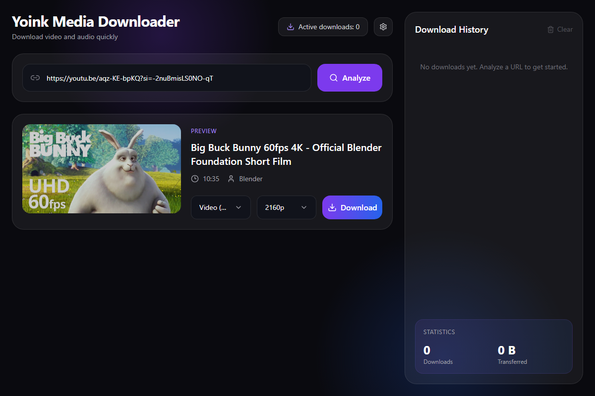

# Yoink Media Downloader

[](https://github.com/ayozetr/yoink-app/releases/latest)


[](LICENSE)
[](https://www.react.doctor/share?p=yoink&s=92&e=1&w=11&f=6)



Yoink is a **local** desktop/web app for downloading high-fidelity video and
audio from many platforms, powered exclusively by
[yt-dlp](https://github.com/yt-dlp/yt-dlp) (with [ffmpeg](https://ffmpeg.org/)
for merging high-quality streams).

It is split into two layers that communicate asynchronously:

- **Frontend** — React + TypeScript + Tailwind CSS (Vite). A reactive, dark-mode
  UI (English/Spanish) that shows previews, lets you pick the container/format,
  quality, subtitles and chapters, and reflects download progress in real time.
- **Backend** — Python + FastAPI (in `backend/`). Wraps yt-dlp, manages the local
  filesystem, and invokes ffmpeg. Metadata is served over REST (`POST /api/info`);
  downloads stream live progress to the UI over a WebSocket (`/api/ws/download`).

## Features

- **Analyze any URL** → preview (title, thumbnail, duration) with the real
  available formats. ~1800 sites via yt-dlp.
- **Live downloads** over WebSocket (percent / speed / ETA), with **cancel**
  and **retry**.
- **Output formats, your choice:**
  - Video — **MP4**, **MOV** or **MKV** (ffmpeg merge), with optional
    **embedded subtitles** (language picker) and **chapters/metadata**.
  - Audio — **MP3**, **M4A**, plus **FLAC**/**WAV** that are only offered when
    the source is genuinely lossless (no fake upscaling).
- **Playlists** — pick which items to download with checkboxes; they download
  sequentially with "X of N" progress.
- **Audio auto-tagging** — after an audio download, an inline card tags the file
  with real artist / album / title / year + **cover art** from **Apple Music,
  Deezer or MusicBrainz** (free, no account; pick the source in Settings); you
  review, edit or search before anything is written. Works per song and across
  whole playlists.
- **History & stats** persisted locally (SQLite), with open-folder and clear.
- **Settings** — download folder (native folder picker), default format/quality,
  **language**, and cookies (browser or `cookies.txt`) for sign-in-only content.
- **English & Spanish UI** (react-i18next), auto-detected from your system
  language and switchable in Settings.
- **Update check** against the latest GitHub release.
- **Self-contained desktop app** (Tauri, Linux & Windows): bundles the backend
  **and ffmpeg** as a sidecar — no Python or ffmpeg install needed.

## Quick start

```bash
python scripts/setup.py    # one-time: venv + backend deps + npm install
python scripts/dev.py      # run backend (:8756) + frontend (:5173) together
```

Then open <http://localhost:5173>. For development you need **ffmpeg** on your
PATH; the packaged desktop app bundles it. See [`CLAUDE.md`](CLAUDE.md) for
per-layer commands.

### Desktop build (Tauri)

```bash
python scripts/fetch_ffmpeg.py    # once: download ffmpeg+ffprobe (LGPL) to bundle
python scripts/build_backend.py   # bundle backend + ffmpeg as a PyInstaller sidecar
npm run tauri build               # installers in src-tauri/target/release/bundle
```

Prerequisites: Rust toolchain and, on Linux, `webkit2gtk` (4.1); on Windows,
WebView2 + MSVC build tools. Full flow in [`docs/releasing.md`](docs/releasing.md).

## Project structure

```
src/                      # frontend (React + TS + Tailwind)
├── components/{layout,ui}
├── features/
│   ├── autotag/          # Apple Music tagging cards (single + playlist batch)
│   ├── downloader/       # URL input, preview, playlist, progress (main column)
│   ├── history/          # download history + stats (sidebar)
│   └── settings/         # settings modal (download dir, defaults, cookies, version)
├── lib/                  # API client + download WebSocket
└── types/                # shared domain types (mirror the backend JSON contract)

backend/                  # FastAPI + yt-dlp engine (see backend/README.md)
src-tauri/                # Tauri desktop shell
scripts/                  # setup.py, dev.py, fetch_ffmpeg.py, build_backend.py
e2e/                      # Playwright end-to-end tests
```

## Contributing

Issues and pull requests are welcome — see [`CONTRIBUTING.md`](CONTRIBUTING.md)
for how to propose a change and the checks to run.

## License

Yoink's own source code is licensed under **CC BY-NC-SA 4.0** (non-commercial,
share-alike) — see [`LICENSE`](LICENSE). Bundled third-party components keep
their own licenses (ffmpeg = LGPL, yt-dlp = Unlicense); see
[`docs/THIRD_PARTY_LICENSES.md`](docs/THIRD_PARTY_LICENSES.md).

## Documentation

- [`CLAUDE.md`](CLAUDE.md) — high-level guide and conventions
- [`CONTRIBUTING.md`](CONTRIBUTING.md) — how to contribute
- [`docs/`](docs/) — architecture, per-layer guides, the [roadmap](docs/ROADMAP.md),
  the [release process](docs/releasing.md) and
  [third-party licenses](docs/THIRD_PARTY_LICENSES.md)
